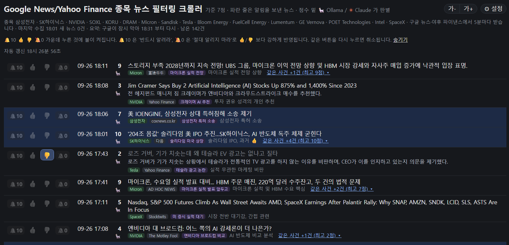

# stocknews_filter (종목 뉴스 필터)

내가 고른 종목의 뉴스를 구글 뉴스와 야후 파이낸스에서 모아, LLM 이 알릴 만한 것만 골라 윈도우 알림과 음성으로 알려준다.
화면·음성·알림·판별 방식은 [saveticker_filter](https://github.com/destory1984/saveticker_filter) 와 같다. 다른 점은 뉴스를 받아 오는 곳뿐이다.

## 왜 만들었나

종목 이름으로 뉴스를 검색하면 하루에 종목당 27~64건이 나왔다 (2026-09-26, 삼성전자·SK하이닉스·NVIDIA). 대부분은 같은 소식을 여러 매체가 다시 쓴 기사이거나,
"펀드 X 가 주식 N 주를 샀다" 같은 자동 생성 기사다. 야후 파이낸스의 종목별 피드는 더 심해서,
2026-09-26 에 `NVDA` 피드 20건 가운데 제목이나 요약에 엔비디아가 나오는 기사는 3건뿐이었다.
그래서 키워드로 한 번 거르고, 남은 것을 LLM 이 내 관심사와 👍/👎 반응을 보고 다시 거르게 만들었다.

## 구동 방식

```
구글 뉴스 RSS ─┐                             stock_alert.py
               ├─ stocknews.py ──▶ data/stocknews.db ────────▶ LLM 판별 (ollama → 안 되면 claude CLI)
야후 RSS ──────┘  5분마다, 종목 키워드로 1차 거름                  7점 이상이면 윈도우 토스트 + 음성
                                                               http://127.0.0.1:18766  판별 목록 · 🔔10 👍 👎 🔕0 반응
```

saveticker_filter 는 사이트가 봇을 막아서 Edge 확장으로 뉴스를 모은다.
구글 뉴스와 야후 파이낸스는 RSS 를 공개하므로 여기서는 확장이 필요 없고, 브라우저를 띄워 둘 필요도 없다.

## 화면

`http://127.0.0.1:18766` 의 판별 목록. 점수, 판별한 LLM(🦙 Ollama / ✴ Claude), 번역 제목, 종목(초록)·언론사·사건 이름(보라)이 보이고,
왼쪽 🔔10 · 👍 · 👎 · 🔕0 으로 반응한다. 파란 줄은 알림을 보낸 뉴스, 같은 사건은 **같은 사건 +N건** 으로 접힌다.
알림이 나가면 목록이 2초 안에 다시 그려지고, 음성은 그 뒤에 읽는다. 목록 창을 안 띄워 두었으면 6초 기다렸다 읽는다.
요약은 접혀 있다. 줄 끝의 **요약 ▾** 를 누르면 편다.
목록 위에 60일 안의 **실적 발표**가 접힌 채로 나온다 (접힌 줄에는 가장 가까운 한 종목, 누르면 전부). 한국 시각으로 (예: `MU 10-01(목) 05:00께 장 뒤 D-5`). 시각은 야후에서 받는다. 나스닥이 알려 주는 대로 회사가 공지한 날짜는 **확정**, 지난 발표일로 어림잡은 날짜는 **추정**(흐린 글씨)으로 적는다. 추정끼리는 야후와 나스닥이 일주일씩 어긋나기도 한다 (09-26 TSLA: 10-21 과 10-28). 정각은 대개 야후의 어림값이라 "께" 를 붙인다. 사흘 안이면 주황. 하루 한 번 받고, `yfinance` 가 없으면 안 나온다.
목록 위 **판별·언론사 성적표** (`/sources`) 에서 내 반응(🔔10·👍·👎·🔕0)과 모델 점수가 얼마나 맞는지, 크게 어긋난 뉴스가 무엇인지 본다. 같은 페이지에서 언론사마다 건수·평균 점수·알림 수·👍/👎 를 보고, 쓸모없는 언론사를 목록에서 가린다. 가려도 판별과 알림은 그대로 한다.
오른쪽 위 **⚙ 설정** 에서 종목과 알림·소리를 바꾼다.



## 구성

| 파일 | 역할 |
|---|---|
| `stock_alert.py` | 5분마다 뉴스를 받아 판별하고 알린다. 판별 목록 페이지(18766)도 연다. saveticker_filter 의 `news_alert.py` 에서 뉴스 출처만 바꿨다 |
| `stocknews.py` | 구글 뉴스·야후 RSS 를 읽고 종목 키워드로 거른다. 혼자 돌려 목록만 볼 수도 있다 |
| `watchlist.json` | 종목 목록. `watchlist.example.json` 을 복사해 고친다 |
| `interests.md` | 판별 기준이 되는 관심사. 고치면 다음 판별부터 반영된다 |
| `store.py` | 뉴스·판별·반응 기록을 SQLite 한 파일(`data/stocknews.db`)에 둔다. koreainvest 의 `bars.db` 와 같은 방식(WAL) |
| `article.py` | 구글 뉴스 링크를 풀어 원문 주소를 찾고 본문 글자를 뽑는다 (요약용, 저장하지 않음) |
| `settings.py` | ⚙ 설정 창 |
| `stock_alert_config.json` | 모델, 기준 점수, 포트, 수집 간격 등. 처음 실행할 때 만들어진다 |
| `stock_alert_bg.vbs` / `stock_alert_stop.bat` | 창 없이 백그라운드 실행 / 종료 |

## 설치

1. `pip install requests winotify edge-tts pywin32 yfinance`, 그리고 터미널에서 `claude` 실행 후 `/login` 한 번.
   ollama 가 켜져 있으면 그쪽을 먼저 쓴다 (`stock_alert_config.json` 의 `model`).
2. `watchlist.example.json` 을 `watchlist.json` 으로 복사하고 종목을 고친다.
3. `stock_alert_bg.vbs` 실행. 로그는 `stock_alert.log`, 목록은 `http://127.0.0.1:18766`.

## 설정 (⚙ 설정)

판별 목록 오른쪽 위 **⚙ 설정** 을 누르면 설정 창이 열린다. 한국투자증권 RSI Monitor 의 설정 창과 같은 모양이고,
스위치나 값을 바꾸면 바로 적용된다 (저장 단추 없음, `stock_alert_config.json` 에 기록). **가- 가+** 로 글자 크기를 바꾼다.

| 칸 | 할 수 있는 것 |
|---|---|
| 종목 | 추가 (이름 + 야후 티커), 이름을 눌러 검색어·언어·티커·꼭 들어갈 말·뺄 말·뺄 언론사 고치기, 휴지통으로 빼기 |
| 알림 | 윈도우 알림 켜고 끄기, 기준 점수, 알림 시한, 텔레그램 켜고 끄기와 전송 테스트 |
| 소리 | 음성으로 읽기 켜고 끄기, 목소리 3가지, 영어 언론사 목소리 (The Motley Fool 같은 영어 이름만 영어 여성 음성으로), 빠르기, 말머리 소리, 조용한 시각, TTS 테스트 |
| 수집 · 판별 | 뉴스 받는 간격과 지금 받기, 밀린 뉴스 시간, 판별 LLM (Ollama / Claude), 모델, 목록에서 숨길 점수 |

- 종목을 추가하면 바로 뉴스를 받아 판별한다. 야후 티커를 넣으면 야후 피드에 뉴스가 있는지 먼저 확인하고, 없으면 추가하지 않는다.
- 영어 이름(Micron)은 영어 구글 뉴스에서 `Micron stock` 으로 찾는다.
- 종목을 빼도 이미 받아 둔 뉴스와 판별 기록은 지우지 않는다. 뺄 때 한 번 더 묻는다.
- 영어 키워드는 낱말 단위로 맞춘다. 티커 `MU` 가 "much" 안에서 걸리지 않는다.
- 텔레그램은 환경변수 `TELEGRAM_BOT_TOKEN` / `TELEGRAM_CHAT_ID` 를 읽는다. 조용한 시각에는 알림음 없이 보낸다.

## watchlist.json

| 항목 | 뜻 |
|---|---|
| `name` | 화면에 보일 이름. `google` 이 없으면 구글 뉴스 검색어로도 쓴다 |
| `google` | 구글 뉴스 검색어 |
| `lang` | 구글 뉴스 언어·지역. `ko`(기본) 또는 `en` |
| `yahoo` | 야후 파이낸스 티커. `NVDA`, `005930.KS`(코스피), `035720.KQ`(코스닥). 없으면 구글만 본다 |
| `keywords` | 제목이나 요약에 이 가운데 하나라도 있어야 남긴다. 없으면 이름과 티커 |
| `exclude` | 이 말이 들어간 기사는 버린다 |
| `exclude_sources` | 이 언론사 기사는 버린다. 영어 엔비디아 검색에는 MarketBeat 의 보유 공시 기사가 하루 10건 넘게 나와서 예시에 넣어 두었다 |
| (규칙) | 옵션 시세 페이지, 시세 페이지, 소송 모집 광고, 기관 보유 공시는 모델에 묻지 않고 0점으로 적는다 (`stocknews.JUNK`). 목록의 점수 칸에 📏 로 보인다. 09-26 까지 판별한 672건에 대 보니 52건이 걸렸고, 모두 모델도 2점 이하로 매긴 것이었다 |

## 판별

saveticker_filter 와 같다.

- 새 뉴스를 최대 10건씩 모아(또는 90초 기다렸다가) 한 번에 묻는다. 프롬프트에 `interests.md` 와 최근 반응(🔔10·👍·👎·🔕0)이 들어간다.
- 뉴스마다 사건 이름을 붙여 같은 소식을 한 줄로 접는다. 알림은 같은 사건이면 한 시간에 한 번만 보낸다.
- 알림은 말로도 읽는다. 말머리 소리 뒤에 "언론사, 제목" 을 읽는다 (영어 제목은 번역한 제목).
  saveticker_filter 와 구별되게 말머리 소리를 `Windows Notify Email.wav` 로 바꿨다.
  `python stock_alert.py --say "삼성전자 목표가 상향"` 으로 들어 볼 수 있다.
- 나온 지 120분(`max_age_min`)이 넘은 뉴스는 목록에만 올리고 알리지 않는다. saveticker_filter 는 60분이다.
  구글 뉴스는 기사가 나온 뒤 늦게 잡히기도 해서 늘렸다.
- `python stock_alert.py --test 15` 로 최근 15건을 판별만 해 볼 수 있다.
- 영어 제목은 판별할 때 한국어로 번역한다 (따로 부르지 않고 판별과 한 번에). 목록·토스트·텔레그램에 번역 제목이 나오고,
  목록에서 제목에 마우스를 올리면 원문이 보인다.

## 요약

- **야후**: RSS 에 기사 설명(2~3문장)이 딸려 온다. 판별할 때 이 설명을 한국어 1~2문장으로 줄여 제목 밑에 붙인다.
- **구글**: RSS 에 제목만 온다. 구글 링크를 풀어 원문을 받고, 본문을 **Ollama 로만** 2~3문장 요약한다. Claude 는 쓰지 않는다.
  - **구글 기사는 목록에서 `요약 받기` 를 누를 때만 요약한다.** 뒤에서 저절로 구글에 묻지 않는다.
    예외는 알림 대상(7점 이상)이다. 알리기 전 날짜를 보려고 원문을 이미 받았으니, Ollama 가 켜져 있으면 그 본문으로 요약한다.
  - 야후 기사는 구글을 거치지 않으니 목록에 보이는 것 모두 저절로 요약한다 (최근 48시간).
  - Ollama 가 꺼져 있으면 기다린다. 판별 목록이 갱신될 때(15초)마다 Ollama 가 켜졌는지 보고, 켜지면 밀린 것을 요약한다.
  - 구글 링크를 자주 풀면 구글이 429 로 막는다. 2026-09-26 에 쉬지 않고 14건을 풀자 7번째부터 막혔고,
    그 뒤 한 시간 넘게 풀리지 않았다. 30초에 한 건씩 풀어도, 막혔다 풀린 뒤 5번째 건에서 다시 막혔다.
    3분에 한 건씩 풀어도 13번째에 막혔다(09-26 21:53~22:27). 그래서 누를 때만 푼다.
    누른 것과 알리기 전 날짜 확인은 30초(`google_alert_gap_sec`), 그 밖에는 3분(`google_gap_sec`) 간격을 지킨다.
    막히면 30분 쉬고, 쉬고 나서도 막혀 있으면 60분, 120분으로 늘린다. 쉬는 시각은 DB 에 적어 두어, 알리미를 다시 켜도 이어서 쉰다. 구글에 물을 때마다 로그에 초 단위로 한 줄 남긴다.
  - 옛 기사 거르기(원문 날짜 확인)도 구글 링크를 풀어야 해서 알림 대상과 누른 것만 한다. 구글이 막는 동안에는 날짜를 못 보고 그대로 알린다.
  - 원문 사이트의 robots.txt 가 막으면 받지 않는다. 본문은 요약에만 쓰고 저장하지 않는다.
- 설정 창의 **구글 기사 요약** 스위치로 끈다.

## 기록 (DB)

`data/stocknews.db` (SQLite) 한 파일에 뉴스(`news`), 판별(`judged`), 반응(`feedback`)을 둔다.
예전 판의 `data/stocknews_날짜.csv`, `news_judged.jsonl`, `news_feedback.jsonl` 은 처음 켤 때 DB 로 옮기고, 옛 파일은 지우지 않는다.
처음부터 다시 는 표를 지우지 않고 `feedback_bak_날짜` 처럼 이름을 바꿔 DB 안에 남긴다.

## MarketBeat 목표가 변경 속도 재기 (시험 중)

증권사 목표가 변경을 뉴스보다 빨리 받을 수 있는지 재 보는 중이다. MarketBeat 약관은 MarketBeat 화면 말고 다른 방법으로
접속하는 것을 금하므로, 서버에서 페이지를 받지 않고 **사용자가 Edge 에 띄워 둔 탭을 확장이 읽는다.**

1. `edge://extensions` → 개발자 모드 → 압축 풀린 파일 로드 → `extension` 폴더.
2. Edge 에 https://www.marketbeat.com/ratings/ (또는 /ratings/us/) 를 열어 둔다. 확장이 5분마다 새로 고치고, 표를 알리미(18766)로 넘긴다.
   오른쪽 아래 초록 딱지에 넘긴 줄 수가 나온다.
3. 새 줄이 처음 보인 시각이 `data/stocknews.db` 의 `mb_ratings` 에 쌓인다. `python mb_report.py` 로 본다.

MarketBeat 페이지에는 줄마다 올라온 시각이 없고, 페이지 밑에 Benzinga 등에서 받은 자료라고 적혀 있다. 그래서 직접 재 본다.

## 목록만 보고 싶을 때

LLM 없이 키워드 거름만 거친 목록이 필요하면 `stocknews.py` 를 쓴다. 표준 라이브러리만 쓴다.

```
python stocknews.py                  # watchlist.json 종목, 최근 하루
python stocknews.py NVDA 삼성전자     # 명령줄에서 바로
python stocknews.py --days 3 --all   # 3일치, 이미 본 기사도
python stocknews.py --telegram       # 새 기사를 텔레그램으로 (TELEGRAM_BOT_TOKEN, TELEGRAM_CHAT_ID 환경변수)
```

## 한계

- 구글 뉴스 링크는 `news.google.com` 을 한 번 거쳐 원문으로 간다.
- 구글 뉴스 RSS 는 검색 한 번에 최대 100건을 준다.
- 야후 파이낸스는 영어 기사 위주라 국내 종목은 외신 보도만 잡힌다.
- 구글 뉴스 RSS 약관은 개인적·비상업적 사용만 허용한다.

## 라이선스

[MIT](LICENSE)
